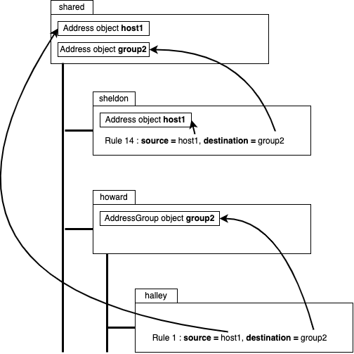
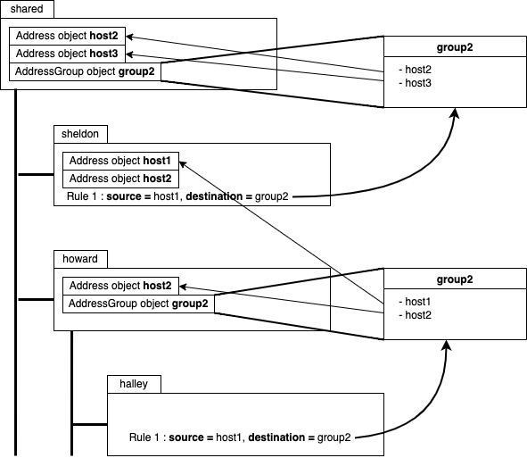
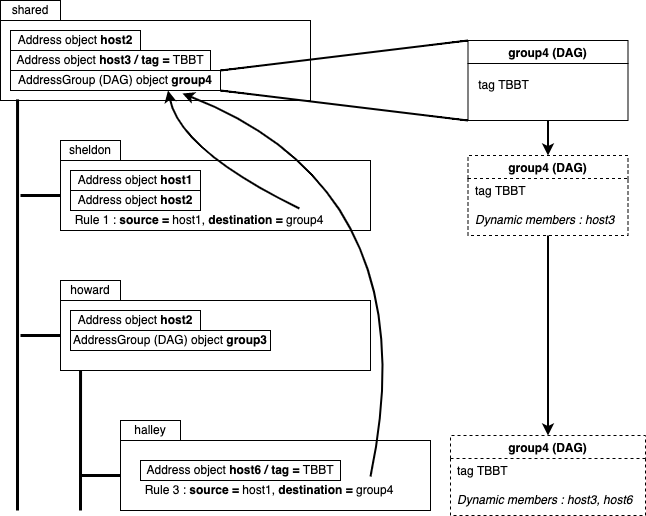

# Palo Alto objects cleaner 

Exhausted by the mess your Panorama has become, because of Address objects existing in 2, 3, or more copies ? 
Because of Service objects being duplicates on your device-groups, while also existing as shared ? 

This tool is for you. 

It will help you cleaning your device-groups hierarchy, by removing all duplicates and replacing them by the best
(and highest) object in the hierarchy. 

## Installation 

#### 1. Clone the repo to your working directory 
```
$ git clone https://github.com/AnthoBalitrand/palo-cleaner.git
```

#### 2. Create a virtual environment (optional) and activate it 
```
$ python3 -m venv ./venv
$ source venv/bin/activate
```

#### 3. Install the requirements 
```
$ pip3 install --trusted-host pypi.org --trusted-host files.pythonhosted.org -r requirements.txt
```

## Usage 

You can display the script startup arguments information by using the --help argument : 

```
$ python3 main.py --help
usage: main.py [-h] --panorama-url PANORAMA_URL [--device-groups DEVICE_GROUPS [DEVICE_GROUPS ...]] --api-user API_USER [--api-password API_PASSWORD] [--apply-cleaning]
               [--delete-upward-objects] [--verbosity] [--max-days-since-change MAX_DAYS_SINCE_CHANGE] [--max-days-since-hit MAX_DAYS_SINCE_HIT]
               [--tiebreak-tag TIEBREAK_TAG] [--apply-tiebreak-tag] [--no-report] [--split-report]

optional arguments:
  -h, --help            show this help message and exit
  --panorama-url PANORAMA_URL
                        Address of the Panorama server to which to connect
  --device-groups DEVICE_GROUPS [DEVICE_GROUPS ...]
                        List of device-groups to be included in the cleaning process
  --api-user API_USER   Username to use for API connection to Panorama
  --api-password API_PASSWORD
                        Password to use for API connection to Panorama
  --apply-cleaning      Apply cleaning operation
  --delete-upward-objects
                        Deletes upward unused objects (shared + intermediates) if all childs are analyzed
  --verbosity, -v       Verbosity level (from 1 to 3)
  --max-days-since-change MAX_DAYS_SINCE_CHANGE
                        Don't apply any change to rules not having be modified since more than X days
  --max-days-since-hit MAX_DAYS_SINCE_HIT
                        Don't apply any change to rules not being hit since more than X days
  --tiebreak-tag TIEBREAK_TAG
                        Tag used to choose preferred replacement object in case of multiple ones (overrides default choice)
  --apply-tiebreak-tag  Applies the tag defined on the --tiebreak-tag argument to objects choosen by the choice algorithm
  --no-report           Does not generates job reports
  --split-report        Split the report file (1 per device-group)

```

Here's a more detailed description of those different parameters : 

| Parameter | values | Description |
| --------- | ------ | ----------- |
| -h or --help | N/A | **(Mandatory)** Displays the list of parameters and a quick description |
| --panorama-url | IP or FQDN | **(Mandatory)** The IP or FQDN of the Panorama appliance to which to connect. If using the --apply-cleaning keyword, make sure this is the active appliance in an high-availability deployment |
| --device-groups | list of strings | The list (with space as a delimiter) of device-groups ta nalyze, in case you want to limit the analyzis / cleaning perimeter | 
| --api-user | string | **(Mandatory)** The XML API user to use for connection to Panorama, and to the firewall appliances if you use the --max-days-since-hit argument | 
| --api-password | string | The password associated to the --api-user account. If you don't specify it as an argument, you will be prompted when starting the script | 
| --apply-cleaning | N/A | Use this argument if you don't want only a report, but if you want the script to change the policies / objects to remove the duplicates, on the perimeter defined by the --device-groups argument values | 
| -v or --verbosity | N/A | Add this argument several times (from 1 to 3) to increase the output log verbosity level | 
| --max-days-since-change | Integer | The number of days since when, if a rule has not been modified, it will not be included in the cleaning process. Needs to be used in conjunction with --max-days-since-hit | 
| --max-days-since-hit | Integer | The number of days since when, if a rule has not been hit, it will not be included in the cleaning process. Needs to be used in conjunction with --max-days-since-change | 
| --tiebreak-tag | string | To force usage of specific objects (which would normally not be chosen by the algorithm) if the provided tag has been applied to those objects | 
| --apply-tiebreak-tag | | Applies the taf defined on the --tiebreak-tag parameter to the choosen objects by the algorithm, to make sure they will remain choose at next script usages | 
| --no-report | | When used, does not create any html report for the run | 
| --split-report | | Will create multiple reports files (globally, one per device-group). Highly recommended in large environments if you don't want huge unexploitables html reports | 

## Capabilities 

This section will give you an overview of what this script is able to do, and what this script is **not** able to do. 

This is subject to evolution. 

Feel free to open new issues if something needs to be fixed / improved. 

- [x] Manage a multi-level hierarchy
- [x] Detect / replace duplicate objects on any device-group in the hierarchy
- [ ] Create objects as shared if there are duplicates "below" and an equivalent does not exists at this level 
- [ ] For AddressObjects having FQDN **name**, check if this value is accurate using a reverse DNS query 
- [x] Replace objects in static groups by duplicates existing at higher level in the hierarchy 
- [ ] Delete / replace duplicates groups
- [x] Replace objects in dynamic groups
- [x] Protect rules (and directly referenced objects) from modification, based on last change date / last hit date 
- [x] Run in dry-run mode, only to generate a report 

#### Objects-type supported 

The following objects types are analyzed and cleaned 

- [x] AddressObject (host, subnet, or FQDN)
- [x] Static AddressGroup
- [x] Tag
- [x] Service
- [x] ServiceGroup 

#### Rulebase types supported

The following rulebases are analyzed to find objects usage 

- [x] Security
- [x] NAT
- [x] Authentication

## Run logic 

This section will try to give you a clear understanding of the inner logic used in the analyze and cleaning process. 


#### 1 - Download device-groups hierarchy from Panorama

- Connection to Panorama
- Download and analysis of the device-groups hierarchy
- Compare with the list of device-groups provided in the --device-groups argument to know which ones need to be analyzed / cleaned 
- Display of the hierarchy and analyzed / cleaned device-groups to the user

    **Remarks :**
- If no device-group is specific at startup, all device-groups are considered included 
- If all child device-groups of a given parent are included, the parent is implicitly included in the process 

Example : 

No device-groups specified, all hierarchy levels are included in the analyzis / cleaning process :
```
$ python3 main.py --panorama-url 192.168.192.10 --api-user apiuser
[22:56:28] [ Panorama ] Connection established
Discovered hierarchy tree is the following :
(  + are directly included  /  * are indirectly included  /  - are not included  )
 F (Fully included = cleaned) / P (Partially included = not cleaned) 
╭────────────────────────────────────────────────────────────────────────────────────────────╮
│ + F shared                                                                                 │
│ ├── + F sheldon                                                                            │
│ ├── + F penny                                                                              │
│ └── + F howard                                                                             │
│     ├── + F halley                                                                         │
│     └── + F neil                                                                           │
╰────────────────────────────────────────────────────────────────────────────────────────────╯
```

Specifying 'sheldon' and 'penny' at startup :

```
$ python3 main.py --panorama-url 192.168.192.10 --api-user apiuser --device-groups sheldon penny
[22:56:40] [ Panorama ] Connection established
Discovered hierarchy tree is the following :
(  + are directly included  /  * are indirectly included  /  - are not included  )
 F (Fully included = cleaned) / P (Partially included = not cleaned) 
╭────────────────────────────────────────────────────────────────────────────────────────────╮
│ * P shared                                                                                 │
│ ├── + F sheldon                                                                            │
│ ├── + F penny                                                                              │
│ └── - howard                                                                               │
│     ├── - halley                                                                           │
│     └── - neil                                                                             │
╰────────────────────────────────────────────────────────────────────────────────────────────╯
```
Note that the 'shared' level is included in the process (it will be analyzed as it is above some analyzed device-groups), 
but it is marked as "P" = Partially included, meaning that it will not be cleaned. 


Specifying 'halley' and 'neil' at startup : 

```
$ python3 main.py --panorama-url 192.168.192.10 --api-user apiuser --device-groups halley neil
[22:56:50] [ Panorama ] Connection established
Discovered hierarchy tree is the following :
(  + are directly included  /  * are indirectly included  /  - are not included  )
 F (Fully included = cleaned) / P (Partially included = not cleaned) 
╭────────────────────────────────────────────────────────────────────────────────────────────╮
│ * P shared                                                                                 │
│ ├── - sheldon                                                                              │
│ ├── - penny                                                                                │
│ └── * F howard                                                                             │
│     ├── + F halley                                                                         │
│     └── + F neil                                                                           │
╰────────────────────────────────────────────────────────────────────────────────────────────╯
```

As all the childs of the device-group 'howard' are explicitly included in the --device-groups argument, 
'howard' is implicitly included too. 
'sheldon' and 'penny' will not be analyzed (neither cleaned). 
The 'shared' level will be analyzed, but not cleaned. 

#### 2 - Download all objects and rulebases from the included device-groups 

The full objects and rulebases of the fully included and partially included device-groups is downloaded at this step. 

**If you use opstate information** (using the --max-days-since-change and --max-days-since-hit parameters), those values are 
downloaded at this step, **by connecting to each of the device-groups members appliances**. 


Make sure the API user account provided at startup is also allowed to connect to all of those appliances, and that the necessary flows are open. 

```
╭───────────────────────────────────╮
│ Downloading objects and rulebases │
╰───────────────────────────────────╯
[13:53:32] [ Panorama ] Shared objects downloaded (19 found)
[13:53:33] [ Panorama ] Shared rulebases downloaded (1 rules found)
[13:53:34] [ Panorama ] Managed devices information downloaded (found 0 devices)
[13:53:35] [ sheldon ] Objects downloaded (6 found)
[13:53:36] [ sheldon ] Rulebases downloaded (2 rules found)
[13:53:37] [ penny ] Objects downloaded (8 found)
[13:53:39] [ penny ] Rulebases downloaded (8 rules found)
[13:53:40] [ howard ] Objects downloaded (0 found)
[13:53:41] [ howard ] Rulebases downloaded (0 rules found)
[13:53:42] [ halley ] Objects downloaded (1 found)
[13:53:44] [ halley ] Rulebases downloaded (0 rules found)
[13:53:45] [ neil ] Objects downloaded (0 found)
[13:53:46] [ neil ] Rulebases downloaded (0 rules found)
```

#### 3 - Objects usage analysis 

At this step, the script will compute several very important things : 
- For objects directly used on the different rulebases, what is their location ? 
  - objects are referenced by their name. Looking at the device-groups hierarchy, the script will find the "nearest" matching the object usage location, going upward 
  - same logic is applied for all objects referenced on the policy : AddressObject, AddressGroups, Service, ServiceGroup, Tag... 



- For IP addresses (hosts or subnets) directly used on rules (not referencing an object), create a matching AddressObject to work with in the next steps 

```
[ penny ] * Created AddressObject for address 10.121.16.0/24 used on rule 'Guest-CheesecakeFactory' 
```

- For referenced groups objects (AddressGroup or ServiceGroup), the group content is recursively explored (parsing content of groups referenced inside groups)
  - For static groups, they can only reference objects at the same level, or at a higher level in the hierarchy compared to where the group is **created** 
  - For dynamic groups, as they just reference tags, they can reference any object at the level where the group is **used**, and upward 





Note that for dynamic groups, "circular reference" situation can occur : the group itself can be assigned the tags that it uses to find its own group members. 
This is handled by the algorithm, and will not cause specific issues. 
However, the following log will appear to advertise you about such a situation : 

```
[ sheldon] * Circular reference found on dynamic AddressGroup 'DYN-GROUP-1' 
```

Once this step will be processed, each device-group will be assigned with a set (list of unique objects) used by the rulebases of this device-group. 
This set will contain tuples of (Object, location) of each and every object found by the exploration process. 

